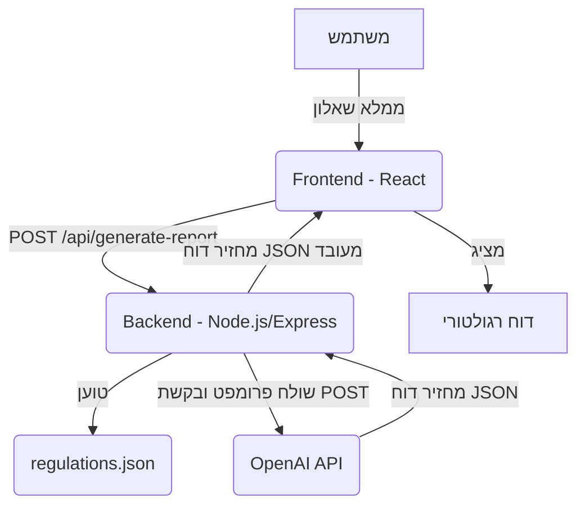

# תיעוד טכני של מערכת הערכת רישוי עסקים

## 1. ארכיטקטורת המערכת
המערכת פועלת במודל של Frontend-Backend עם אינטגרציה למודל שפה חיצוני. ה-Frontend (React) מספק את ממשק המשתמש ומאפשר למשתמשים להזין נתוני עסק באמצעות שאלון. ה-Backend (Node.js/Express) משמש כשרת API המתווך בין ה-Frontend למודל ה-AI, ומכיל את לוגיקת התאמת הדרישות ואת נתוני הרגולציה.

### רכיבים עיקריים:
*   **Frontend (React):** ממוקם בתיקיית `frontend/`. אחראי על הצגת השאלון, חיווי טעינה, והצגת הדוח הסופי.
*   **Backend (Node.js/Express):** ממוקם בתיקיית `backend/`. אחראי על קבלת בקשות מה-Frontend, עיבודן, התאמת דרישות, קריאה ל-OpenAI API, ועיבוד התגובה.
*   **נתוני רגולציה:** קובץ `regulations.json` בתיקייה `data/processed/`. מכיל את המידע הרגולטורי המבונֶה.
*   **OpenAI API:** שירות חיצוני המשמש ליצירת הדוח החכם.



## 2. תיעוד API

נקודת הקצה העיקרית במערכת היא `/api/generate-report` המטפלת ביצירת הדוח הרגולטורי.

### `POST /api/generate-report`

**תיאור:** מקבלת פרטי עסק, מתאימה דרישות רגולטוריות רלוונטיות, ומייצרת דוח חכם באמצעות מודל AI.

**כתובת:** `http://localhost:3001/api/generate-report`

**סוג בקשה (Content-Type):** `application/json`

**גוף הבקשה (Request Body - JSON):**

```json
{
  "businessDetails": {
    "businessType": "string",       // לדוגמה: "bakery", "restaurant", "cafe"
    "businessSize": "number",       // גודל העסק במ"ר
    "hasSeating": "boolean",        // האם יש מקומות ישיבה
    "seatingCapacity": "number",    // מספר מקומות ישיבה (אם יש)
    "hasGas": "boolean",            // האם יש שימוש בגז
    "hasDelivery": "boolean",       // האם יש שירותי משלוחים
    "hasAlcohol": "boolean",        // האם יש מכירת אלכוהול
    "hasFoodTransportation": "boolean", // האם נדרשת הובלת מזון
    "handlesRawMeat": "boolean",    // האם מטפל בבשר נא
    "handlesDairy": "boolean",      // האם מטפל במוצרי חלב
    "handlesFish": "boolean",       // האם מטפל בדגים
    "handlesVegetables": "boolean", // האם מטפל בירקות
    "hasTrainedStaff": "boolean",   // האם יש צוות מיומן
    "hasHealthCertificates": "boolean" // האם יש תעודות בריאות לצוות
  }
}
```

**תגובה מוצלחת (Response 200 OK - JSON):**

```json
{
  "sections": [
    {
      "title": "דרישות כלליות",
      "requirements": [
        {
          "title": "string",        // כותרת הדרישה (מזהה או חלק מהטקסט המקורי)
          "description": "string",    // תיאור הדרישה (מבוסס על הטקסט המקורי)
          "priority": "number",     // רמת עדיפות (לדוגמה: 6 - דחוף, 3 - בינוני)
          "notes": "string",          // הערות נוספות (אופציונלי)
          "recommendations": [
            "string"                // המלצות פעולה (אופציונלי)
          ]
        }
      ]
    },
    {
      "title": "סיכום והמלצות",
      "requirements": [
        {
          "title": "סיכום",
          "description": "string",  // סיכום כללי מה-AI
          "priority": "number"
        },
        {
          "title": "דרישות דחופות",
          "description": "string",  // רשימת דרישות דחופות מה-AI (מחרוזת ארוכה)
          "priority": "number"
        },
        {
          "title": "המלצות",
          "description": "string",  // רשימת המלצות מה-AI (מחרוזת ארוכה)
          "priority": "number"
        },
        {
          "title": "צעדים מעשיים",
          "description": "string",  // רשימת צעדים מעשיים מה-AI (מחרוזת ארוכה)
          "priority": "number"
        },
        {
          "title": "הערות חשובות",
          "description": "string",  // רשימת הערות חשובות מה-AI (מחרוזת ארוכה)
          "priority": "number"
        }
      ]
    }
  ]
}
```

**תגובת שגיאה (Response 400/500 - JSON):**

```json
{
  "error": "string",
  "message": "string"
}
```

## 3. מבנה הנתונים

### `data/processed/regulations.json`
קובץ זה מכיל את המידע הרגולטורי המעובד. כל אובייקט ברמה העליונה מייצג סעיף רגולטורי.

```json
[
  {
    "id": "string",             // מזהה הסעיף (לדוגמה: "110")
    "title": "string",          // כותרת הסעיף
    "keywords": [
      "string"                  // מילות מפתח לזיהוי רלוונטיות הסעיף
    ],
    "appliesTo": [
      "string"                  // סוגי עסקים שהסעיף חל עליהם (לדוגמה: "bakery", "restaurant", "all")
    ],
    "minBusinessSize": "number", // גודל עסק מינימלי שהסעיף חל עליו (אופציונלי)
    "maxBusinessSize": "number", // גודל עסק מקסימלי שהסעיף חל עליו (אופציונלי)
    "minSeatingCapacity": "number", // קיבולת ישיבה מינימלית (אופציונלי)
    "maxSeatingCapacity": "number", // קיבולת ישיבה מקסימלית (אופציונלי)
    "hasGas": "boolean",           // האם חל אם יש שימוש בגז (אופציונלי)
    "hasDelivery": "boolean",      // האם חל אם יש משלוחים (אופציונלי)
    "hasAlcohol": "boolean",       // האם חל אם יש אלכוהול (אופציונלי)
    "handlesRawMeat": "boolean",   // האם חל אם מטפל בבשר נא (אופציונלי)
    "handlesDairy": "boolean",     // האם חל אם מטפל במוצרי חלב (אופציונלי)
    "handlesFish": "boolean",      // האם חל אם מטפל בדגים (אופציונלי)
    "handlesVegetables": "boolean",// האם חל אם מטפל בירקות (אופציונלי)
    "hasTrainedStaff": "boolean",  // האם חל אם יש צוות מיומן (אופציונלי)
    "hasHealthCertificates": "boolean", // האם חל אם יש תעודות בריאות לצוות (אופציונלי)
    "requirements": [
      {                            // דרישות ספציפיות בתוך הסעיף
        "text": "string",        // טקסט הדרישה
        "type": "string",        // סוג הדרישה (לדוגמה: "hygiene", "safety")
        "isCritical": "boolean"  // האם הדרישה קריטית
      }
    ]
  }
]
```

### מבנה הדוח הסופי (Frontend Display)
כפי שתואר ב"תגובה מוצלחת" בסעיף 2. ה-Frontend מצפה למערך של `sections`, כאשר כל `section` מכיל `title` ומערך של `requirements`. לכל `requirement` יש `title`, `description`, `priority` ושדות אופציונליים נוספים.

## 4. עיבוד נתונים גולמיים (Raw Data Processing)

המערכת הנוכחית משתמשת בקובץ `regulations.json` שהוא תוצר של תהליך עיבוד מקדים של נתוני רגולציה גולמיים (כמו קובצי PDF/Word). סקריפט עיבוד זה אינו חלק מהקוד המצורף כרגע, אך הגישה הכללית לעיבוד נתונים מסוג זה תכלול את השלבים הבאים:

### א. חילוץ טקסט:
*   **עבור קבצי PDF:** שימוש בספריות כמו `pypdf` (Python) או `pdf-parse` (Node.js) כדי לחלץ את הטקסט הגולמי מתוך קובץ ה-PDF.
*   **עבור קבצי Word:** שימוש בספריות כמו `python-docx` (Python) או `mammoth.js` (Node.js) כדי לחלץ טקסט מקובץ Word.

### ב. ניתוח מבנה ומידע:
לאחר חילוץ הטקסט, נדרש ניתוח אוטומטי או חצי-אוטומטי של הטקסט כדי לזהות את מבנה הרגולציות:
*   **זיהוי סעיפים:** איתור כותרות סעיפים, מספורים (לדוגמה, "סעיף 110"), ותת-סעיפים.
*   **חילוץ מאפיינים:** זיהוי מילות מפתח, סוגי עסקים רלוונטיים (כמו "מאפייה", "מסעדה"), טווחי גודל, תנאים בוליאניים (כמו "שימוש בגז", "משלוחים"). זה יכול לכלול שימוש בביטויים רגולריים (Regular Expressions) או אף מודלים בסיסיים של עיבוד שפה טבעית (NLP) לזיהוי ישויות וקשרים.
*   **חילוץ דרישות:** זיהוי הדרישות הספציפיות בתוך כל סעיף, וסיווגן (לדוגמה: `type`, `isCritical`).

### ג. המרה לפורמט מובנה:
*   בסיום תהליך הניתוח, המידע מחולץ נשמר בפורמט JSON, כפי שמוצג בסעיף `data/processed/regulations.json` בתיעוד זה.

### ד. הערה לגבי ההטמעה הנוכחית:
במהלך הפיתוח, נתונים אלו סופקו כבר בפורמט JSON מובנה (חלקית מתוך קובץ ה-PDF המקורי וחלקית מתוך שכתוב ועיבוד ידני), מה שאפשר התמקדות בליבת המשימה: פיתוח מנוע ההתאמה ויצירת הדוח החכם באמצעות AI. עבור יישום מלא, שלב העיבוד האוטומטי מקובץ גולמי יהיה קריטי.

## 5. אלגוריתם ההתאמה (backend/logic/services/matchRules.js)

פונקציית `matchRequirements` אחראית לסינון סעיפי הרגולציה מתוך `regulations.json` בהתאם לפרטי העסק שסופקו בשאלון.

### לוגיקת הסינון:
1.  **איטרציה על כל סעיף רגולטורי:** הפונקציה עוברת על כל אובייקט סעיף במערך `regulatoryData`.
2.  **התאמה לפי `appliesTo`:** בודקת האם סוג העסק (businessType) מתאים לערכים במערך `appliesTo` של הסעיף, או אם `appliesTo` כולל "all".
3.  **התאמה לפי מילות מפתח (`keywords`):** בודקת האם מילות מפתח מתוך `businessDetails` נמצאות במערך `keywords` של הסעיף.
4.  **התאמה לפי גודל העסק ותפוסה:** בודקת האם `businessSize` ו-`seatingCapacity` (אם רלוונטיים) נופלים בטווחים `minBusinessSize`/`maxBusinessSize` ו-`minSeatingCapacity`/`maxSeatingCapacity` של הסעיף.
5.  **התאמה לפי מאפיינים בוליאניים:** בודקת התאמה עבור מאפיינים כמו `hasGas`, `hasDelivery`, `hasAlcohol`, `handlesRawMeat` וכו'. אם מאפיין כזה מוגדר בסעיף (לדוגמה: `hasGas: true`), הוא חייב להתאים לערך שהוזן על ידי המשתמש.
6.  **החזרת סעיפים מותאמים:** הפונקציה מחזירה רק את הסעיפים שעומדים בכל הקריטריונים הרלוונטיים. המידע המוחזר הוא מוגבל ל-`id`, `title`, ו-`requirements` של כל סעיף כדי לצמצם את גודל הפרומפט ל-AI.

### זרימה:
```mermaid
graph TD
    A[פרטי עסק מהשאלון] --> B{matchRequirements(businessDetails, regulatoryData)}
    B --> C{לולאה על כל סעיף ב-regulations.json}
    C --> D{בדיקת appliesTo, keywords, businessSize, seatingCapacity}
    D --> E{בדיקת מאפיינים בוליאניים (hasGas, hasDelivery, etc.)}
    E -- תואם --> F[הוסף סעיף לרשימת סעיפים רלוונטיים (מצומצם)]
    F --> B
    B --> G[רשימת סעיפים רלוונטיים מצומצמת ל-AI]
``` 